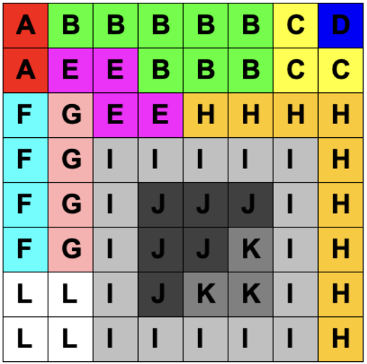

<h1 align="center">Tugas Kecil 1 IF2211 Strategi Algoritma Penyelesaian IQ Puzzler Pro dengan Algoritma Brute Force</h1>

<p align="center">
  
</p>

## Tentang

### IQ Puzzler Pro Solver

IQ Puzzler Pro adalah permainan papan yang diproduksi oleh perusahaan Smart Games. Tujuan dari permainan ini adalah pemain harus dapat mengisi seluruh papan dengan piece (blok puzzle) yang telah tersedia. Program ini dibuat untuk menyelesaikan IQ Puzzler Pro secara otomatis menggunakan algoritma brute force.

## Struktur Program

```bash
.
├── README.md
├── bin                     # folder untuk menyimpan hasil compile
│   ├── lib
│   │   ├── Board.class
│   │   ├── IO.class
│   │   └── Puzzle.class
│   └── main.class
├── doc                     # Folder penyimpanan laporan
├── src                     # Source code
│   ├── lib                 # Library
│   │   ├── Board.java
│   │   ├── IO.java
│   │   └── Puzzle.java
│   └── main.java           # Main program file
└── test                    # Test files , input and output
    ├── input               # Input test cases
    └── output              # Output
        ├── image           # Image output files
        └── txt             # Text output files
```

## Deskripsi Tambahan Struktur Program

- algoritma brute-force untuk penyelesaian terdapat pada `/src/lib/board.java` pada method `solve()`
- file input terletak pada `/test/input`
- file output .txt terletak pada `/test/output/txt`
- file output .png terletak pada `/test/output/image`

## Cara Penggunaan

### Clone Repositori

clone repositori ini dengan command

```sh
git clone https://github.com/AlfianHanifFY/Tucil1_13523073.git
```

ubah directory

```sh
cd Tucil1_13523073
```

### Menjalankan Program

Program ini telah dikompilasi sebelumnya sehingga Anda hanya perlu menjalankan perintah berikut:

```sh
java -cp bin main
```

### Mengompilasi Ulang (Jika Diperlukan)

Jika Anda ingin mengompilasi ulang kode sebelum menjalankan program, gunakan perintah berikut:

```sh
javac -cp "src/lib/*" -d bin src/main.java
```

Kemudian jalankan program dengan perintah:

```sh
java -cp bin main
```

### Panduan penggunaan program

- Masukkan input testcase berupa nama file.txt yang telah disimpan pada `test/input`
<p align="center">
  
</p>

- Program akan menampilkan status konfigurasi dan hasil testcase
<p align="center">
  
</p>

- Hasil testcase dapat disimpan dalam bentuk `.txt` dan `.png`
<p align="center">
  
</p>

- Hasil yang telah berhasil disimpan dapat dilihat pada `test/output/txt` atau `test/output/image`

## Kontributor

|   NIM    |             Nama             |           Email           |
| :------: | :--------------------------: | :-----------------------: |
| 13523073 | Alfian Hanif Fitria Yustanto | Alfian.yustanto@gmail.com |
